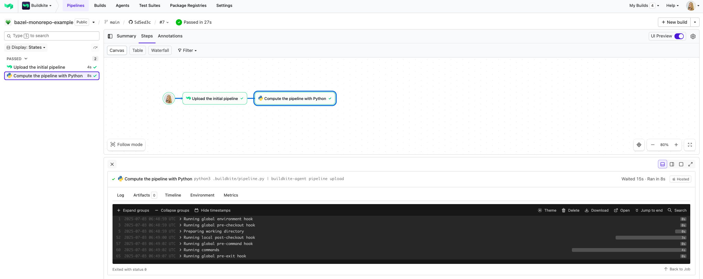

# Buildkite Bazel Monorepo Example

[](https://buildkite.com/buildkite/bazel-monorepo-example/builds/latest?branch=main)
[](https://buildkite.com/new)

This repository is an example [Buildkite](https://buildkite.com/) pipeline for building and testing a simple Python monorepo using [Bazel](https://bazel.build).

👉 **See this example in action:** [buildkite.com/buildkite/bazel-monorepo-example](https://buildkite.com/buildkite/bazel-monorepo-example/builds/latest?branch=main)

See the full [Getting Started Guide](https://buildkite.com/docs/guides/getting-started) for step-by-step instructions on how to get this running, or try it yourself:

[](https://buildkite.com/new)

<a href="https://buildkite.com/buildkite/bazel-monorepo-example/builds/latest?branch=main">
  
</a>

<!-- docs:start -->

## How it works

This simple hello-world example uses Bazel to build and test and a Python library (a `py_library` package, in Bazel parlance) and a Python script (or `py_binary`). The binary depends on the library, and the library gets built and packaged (by Bazel) as a Python wheel.

The repo is configured with a Buildkite [pipeline](https://buildkite.com/buildkite/bazel-monorepo-example) that combines [`bazel query`](https://bazel.build/query/quickstart) with Buildkite [dynamic pipelines](https://buildkite.com/docs/pipelines/configure/dynamic-pipelines) to compute a pipeline definition at runtime based on the content of each commit. A [Buildkite plugin](https://github.com/buildkite-plugins/bazel-annotate-buildkite-plugin) also converts [Bazel Event Protocol (BEP)](https://bazel.build/remote/bep) output into Buildkite [annotations](https://buildkite.com/docs/apis/rest-api/annotations) and appends them to each build. Python packages are uploaded as Buildkite [artifacts](https://buildkite.com/docs/pipelines/configure/artifacts).

## Build all packages

```bash
$ bazel build //...

INFO: Analyzed 6 targets (0 packages loaded, 0 targets configured).
INFO: Found 6 targets...
INFO: Elapsed time: 0.127s, Critical Path: 0.00s
INFO: 1 process: 1 internal.
INFO: Build completed successfully, 1 total action
```

## Build individual packages

```bash
$ bazel build //library/...

INFO: Analyzed 4 targets (1 packages loaded, 2167 targets configured).
INFO: Found 4 targets...
INFO: Elapsed time: 0.477s, Critical Path: 0.00s
INFO: 1 process: 1 internal.
INFO: Build completed successfully, 1 total action

$ bazel build //app/...
INFO: Analyzed 2 targets (42 packages loaded, 417 targets configured).
INFO: Found 2 targets...
INFO: Elapsed time: 0.651s, Critical Path: 0.31s
INFO: 9 processes: 9 internal.
INFO: Build completed successfully, 9 total actions
```

## Query for package's reverse dependencies

```bash
$ bazel query "rdeps(//..., //library/...)"

//app:main
//app:test_main
//library:hello
//library:hello_wheel
//library:hello_wheel.dist
//library:hello_wheel.publish
//library:hello_wheel_dist
//library:test_hello
```

## Run all tests

```bash
$ bazel test //...

INFO: Analyzed 6 targets (0 packages loaded, 0 targets configured).
INFO: Found 4 targets and 2 test targets...
INFO: Elapsed time: 0.095s, Critical Path: 0.00s
INFO: 1 process: 1 internal.
INFO: Build completed successfully, 1 total action
PASSED: //app:test_main
INFO: From Testing //app:test_main
==================== Test output for //app:test_main:
Hey! there's a message from the Python library: 'Hello, world!'
================================================================================
PASSED: //library:test_hello
INFO: From Testing //library:test_hello
==================== Test output for //library:test_hello:
.
----------------------------------------------------------------------
Ran 1 test in 0.000s

OK
================================================================================
//app:test_main                                                 (cached) PASSED in 0.1s
//library:test_hello                                            (cached) PASSED in 0.3s

Executed 0 out of 2 tests: 2 tests pass.
```

## Run the app

```bash
$ bazel run //app:main

INFO: Analyzed target //app:main (0 packages loaded, 0 targets configured).
INFO: Found 1 target...
Target //app:main up-to-date:
  bazel-bin/app/main
INFO: Elapsed time: 0.245s, Critical Path: 0.01s
INFO: 1 process: 1 internal.
INFO: Build completed successfully, 1 total action
INFO: Running command line: bazel-bin/app/main

The Python library says: 'Hello, world!'
```

## Visualize a target graph

For example, to generate a PNG of the `//app:main` target's dependencies:

```bash
$ bazel query --noimplicit_deps 'deps(//app:main)' --output graph | dot -Tpng -o graph.png
```


Requires [GraphViz](https://graphviz.org/).

## Generate the Buildkite pipeline

Also annotates the build with custom Markdown driven by Bazel's BEP output:


```bash
$ python3 .buildkite/pipeline.py

{
    "steps": [
        {
            "label": ":bazel: Build and test //app/...",
            "commands": [
                "bazel test //app/...",
                "bazel build //app/... --build_event_json_file=bazel-events.json"
            ],
            "plugins": [
                {
                    "bazel-annotate#v0.1.0": {
                        "bep_file": "bazel-events.json"
                    }
                }
            ]
        },
        {
            "label": ":bazel: Build and test //library/...",
            "commands": [
                "bazel test //library/...",
                "bazel build //library/... --build_event_json_file=bazel-events.json"
            ],
            "plugins": [
                {
                    "bazel-annotate#v0.1.0": {
                        "bep_file": "bazel-events.json"
                    }
                }
            ]
        }
    ]
}
```

:point_up: In this example, both the `app` and `library` packages were modified in the latest commit.

<!-- docs:end -->

## License

See [LICENSE.md](LICENSE.md) (MIT)